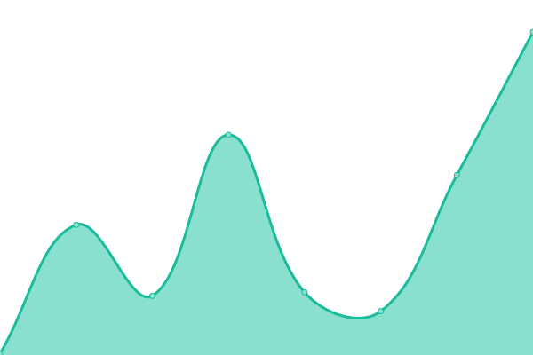
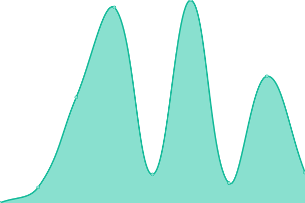

# [📈 Live Status](https://RisaInasaka.github.io/Uptime): <!--live status--> **🟩 All systems operational**

This repository contains the open-source uptime monitor and status page for [稲坂梨彩](https://inasaka.eu.org), powered by [Upptime](https://github.com/upptime/upptime).

With [Upptime](https://upptime.js.org), you can get your own unlimited and free uptime monitor and status page, powered entirely by a GitHub repository. We use [Issues](https://github.com/RisaInasaka/Uptime/issues) as incident reports, [Actions](https://github.com/RisaInasaka/Uptime/actions) as uptime monitors, and [Pages](https://RisaInasaka.github.io/Uptime) for the status page.

<!--start: status pages-->
<!-- This summary is generated by Upptime (https://github.com/upptime/upptime) -->
<!-- Do not edit this manually, your changes will be overwritten -->
<!-- prettier-ignore -->
| URL | Status | History | Response Time | Uptime |
| --- | ------ | ------- | ------------- | ------ |
|  NRT node | 🟩 Up | [nrt-node.yml](https://github.com/RisaInasaka/Uptime/commits/HEAD/history/nrt-node.yml) | 

 556ms
     
 | 

<a href="https://RisaInasaka.github.io/Uptime/history/nrt-node">100.00%</a>
    

|  [Bitbucket Pages](https://meaqua-work.bitbucket.io) | 🟩 Up | [bitbucket-pages.yml](https://github.com/RisaInasaka/Uptime/commits/HEAD/history/bitbucket-pages.yml) | 

 439ms
     
 | 

<a href="https://RisaInasaka.github.io/Uptime/history/bitbucket-pages">100.00%</a>
    

|  [Cloudflare Pages](https://meaqua-work.pages.dev) | 🟩 Up | [cloudflare-pages.yml](https://github.com/RisaInasaka/Uptime/commits/HEAD/history/cloudflare-pages.yml) | 

 127ms
     
 | 

<a href="https://RisaInasaka.github.io/Uptime/history/cloudflare-pages">100.00%</a>
    

|  [Firebase Hosting](https://meaqua-work.web.app) | 🟩 Up | [firebase-hosting.yml](https://github.com/RisaInasaka/Uptime/commits/HEAD/history/firebase-hosting.yml) | 

 126ms
     
 | 

<a href="https://RisaInasaka.github.io/Uptime/history/firebase-hosting">100.00%</a>
    

|  [Github Pages](https://risainasaka.github.io) | 🟩 Up | [github-pages.yml](https://github.com/RisaInasaka/Uptime/commits/HEAD/history/github-pages.yml) | 

 99ms
     
 | 

<a href="https://RisaInasaka.github.io/Uptime/history/github-pages">100.00%</a>
    

|  [Gitlab Pages](https://meaqua.gitlab.io) | 🟩 Up | [gitlab-pages.yml](https://github.com/RisaInasaka/Uptime/commits/HEAD/history/gitlab-pages.yml) | 

 514ms
     
 | 

<a href="https://RisaInasaka.github.io/Uptime/history/gitlab-pages">100.00%</a>
    

|  [Heroku](https://meaqua.herokuapp.com) | 🟩 Up | [heroku.yml](https://github.com/RisaInasaka/Uptime/commits/HEAD/history/heroku.yml) | 

 637ms
     
 | 

<a href="https://RisaInasaka.github.io/Uptime/history/heroku">100.00%</a>
    

|  [Netlify](https://meaqua.netlify.app) | 🟩 Up | [netlify.yml](https://github.com/RisaInasaka/Uptime/commits/HEAD/history/netlify.yml) | 

 110ms
     
 | 

<a href="https://RisaInasaka.github.io/Uptime/history/netlify">99.88%</a>
    

|  [Render](https://meaqua.onrender.com) | 🟩 Up | [render.yml](https://github.com/RisaInasaka/Uptime/commits/HEAD/history/render.yml) | 

 321ms
     
 | 

<a href="https://RisaInasaka.github.io/Uptime/history/render">100.00%</a>
    

|  [Surge](https://meaqua.surge.sh) | 🟩 Up | [surge.yml](https://github.com/RisaInasaka/Uptime/commits/HEAD/history/surge.yml) | 

 370ms
     
 | 

<a href="https://RisaInasaka.github.io/Uptime/history/surge">100.00%</a>
    

|  [Vercel](https://meaqua-work.vercel.app) | 🟩 Up | [vercel.yml](https://github.com/RisaInasaka/Uptime/commits/HEAD/history/vercel.yml) | 

 107ms
     
 | 

<a href="https://RisaInasaka.github.io/Uptime/history/vercel">100.00%</a>
    

|  [4everland](https://meaqua.4everland.app) | 🟩 Up | [4everland.yml](https://github.com/RisaInasaka/Uptime/commits/HEAD/history/4everland.yml) | 

 525ms
     
 | 

<a href="https://RisaInasaka.github.io/Uptime/history/4everland">98.85%</a>
    

<!--end: status pages-->

[**Visit our status website →**](https://RisaInasaka.github.io/Uptime)

## 📄 License

- Powered by: [Upptime](https://github.com/upptime/upptime)
- Code: [MIT](./LICENSE) © [稲坂梨彩](https://inasaka.eu.org)
- Data in the `./history` directory: [Open Database License](https://opendatacommons.org/licenses/odbl/1-0/)
